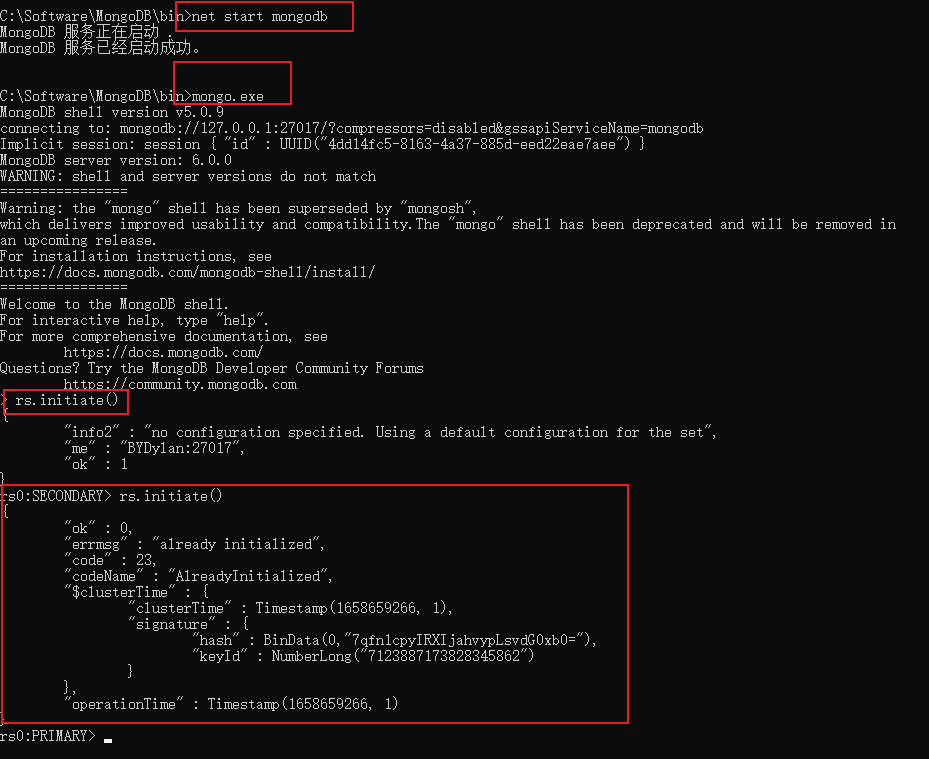

# 下载 MongoDB
- https://www.mongodb.com/download-center#community

# Windows安装
## 1.设置环境变量
## 2.初始化数据目录,安装服务
```sh
mongod --dbpath C:\Software\MongoDB\data --config C:\Software\MongoDB\bin\mongod.cfg --logpath C:\Software\MongoDB\log\mongodb.log --logappend --install --serviceName "MongoDB"
```
## 3.启动服务,停止服务
```sh
net start MongoDB
net stop MongoDB
# mongodb 6.0.0 windows 没有提供 mongo.exe 登录客户端,从 5.* 版本拷贝过来
# 启动后需命令行登录执行初始化命令.否则navicat登录会报错 node is not in primary or recovering state

rs.initiate()
```
## 4.设置用户密码,只能单独给一个库创建用户权限
```mongojs
use admin;
db.createUser({user: 'root', pwd: 'By96o122', roles: [{ role: "root", db: "admin" }]});
```
## 5.检查是否创建成功
```mongojs
db.auth('root', 'By96o122');
```
## 6.查看已有用户
```mongojs
db.system.users.find().pretty();
show users;
```
## 7.删除用户
```mongojs
db.system.users.remove({user:'root'});
```
## 8.修改配置,mongod.cfg,没有的文件直接新建
```sh
# 配置IP端口
net:
    port: 27017
    bindIp: 0.0.0.0
# 数据路径
storage:
    dbPath: C:\Software\MongoDB\data
# 日志文件
systemLog:
    path: C:\Software\MongoDB\log\mongodb.log
    destination: file
    logAppend: true
# 开启密码登录
# windows 安装 openSSL http://slproweb.com/products/Win32OpenSSL.html
# openssl rand -base64 666 > C:\Software\MongoDB\mongodb.keyfile
security:
    authorization: enabled
    keyFile: C:\Software\MongoDB\mongodb.keyfile
# 副本集
replication:
    replSetName: "rs0"
```
## 重启后登录配置
```mongojs
# 密码登录
mongo --port 27017 -u root -p By96o122 --authenticationDatabase admin
# 初始化副本集
# 查看
rs.conf();
# 初始化
rs.initiate();
# 修改内容
cfg = rs.conf();
cfg.members[0].host = "127.0.0.1:27017"
rs.reconfig(cfg);
# 或者
config = {_id: "replication",members: [{_id: 0,host: "127.0.0.1:27017"}]};
rs.initiate(config);
```